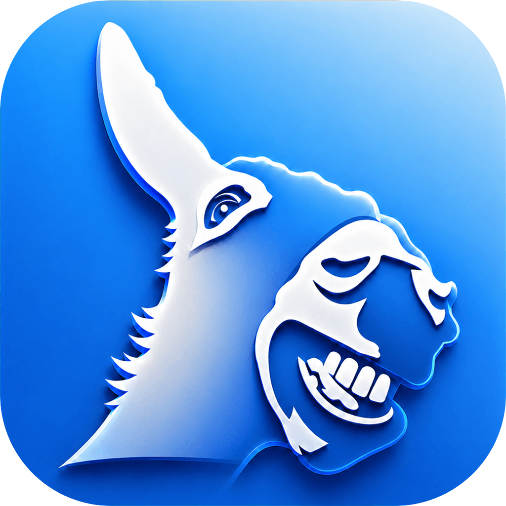
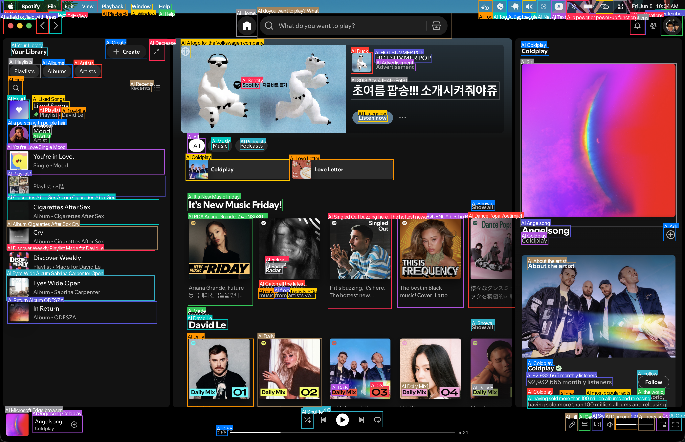
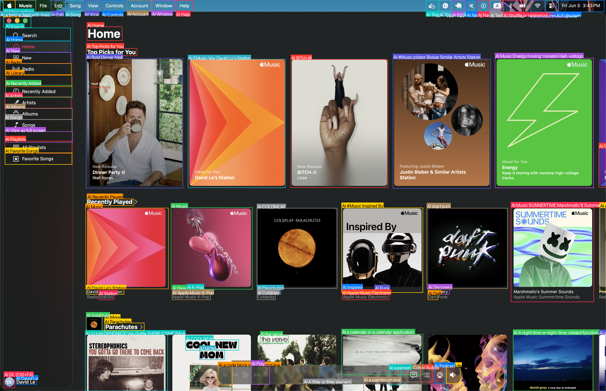

<p align="center">
  
</p>

<h1 align="center">Donkey</h1>

<p align="center"><i>An open-source desktop agent for macOS that sees your screen and runs your apps for you.</i></p>

<p align="center">
  <a href="LICENSE"></a>
  
  <a href="https://donkeyuse.com/donkeyvision"></a>
</p>

Donkey is two things in one repository:

- **The Donkey app** — a low-latency Mac agent you hand a task to, then watch it work across your real apps, files, and accounts.
- **Donkey Vision** — the screen-understanding API behind the app, available on its own so you can build computer-use tools of your own.

---

## The app

Summon Donkey with a double-tap of **Command**, then type or speak what you want done. It plans the task, drives your apps to do it, and streams every step in the menu-bar notch so you can follow along or step in. When it has a result — a merged PDF, a transcript, a drafted message — it pauses for your approval.

Donkey runs **on your machine**. Screen capture, local context, and app control stay on-device; only model decisions go to the backend. It's open source, so you can read exactly what it does and where your data goes.

<p align="center">
  
  <br />
  <sub><i>What Donkey sees: any screen becomes structured, clickable UI — boxes, labels, and center points.</i></sub>
</p>

### What you can ask it for

Tell it what you want in plain language. A few things people hand it:

**Files and documents**

- `merge invoice-jan.pdf, invoice-feb.pdf and invoice-mar.pdf into one file and add page numbers`
- `redact every Social Security number from contract.pdf and flatten the result`
- `fill out f1120.pdf using 1120data.txt`
- `extract the table from q3-figures.pdf into a CSV`
- `find every file over 1GB I haven't opened in 6 months and move them into ~/Archive`

**Media**

- `download the audio from <youtube url> as an mp3`
- `extract the audio from meeting.mov as an mp3 and give me a transcript with the action items pulled out`
- `create a 1-minute clip of this video and overlay the Korean translation, starting at the 15-minute mark`

**Apps and system**

- `text my wife I'm running 20 minutes late`
- `create a playlist with the top 10 songs from 2021`
- `in the open Keynote deck, make every slide title bold`
- `turn on dark mode and enable Night Shift`

**Web and research**

- `compare the pricing of the top 3 note-taking apps and write me a summary doc on my Desktop`
- `give me a markdown of donkeyuse.com`
- `if it's going to rain tomorrow, remind me to grab an umbrella`

### It knows when not to act

The same loop decides when *not* to run something:

- Ask `what can you do?` and it answers in a sentence; it doesn't open a shell or touch your files.
- Say `send it to her` with no context and it asks who and what, instead of guessing.
- When a download comes back with a 403, it tells you it failed instead of reporting success.

### How it works

A task isn't one big model call. It's a loop of small, checked steps:

```text
understand the turn  →  decide the next single tool call  →  validate it
        ↑                                                        ↓
   record what happened  ←  execute through the guarded executor
```

The model decides *what* to do next; the Swift runtime decides *whether and how* it actually happens — owning permissions, focus checks, execution, and verification. The harness is app-agnostic: it knows how to plan, act, verify, and recover, but nothing about specific apps. App knowledge lives in skills, catalog data, and memory.

For the full picture, start with [`docs/guides/agent-harness.md`](docs/guides/agent-harness.md).

### Why hosted models

Capture, context, and local app control run on-device for speed and privacy. Model-backed decisions go to the Donkey backend, which owns provider credentials and model selection. Local model weights are currently too large to ship in a practical install and too slow for the desktop loop, so the supported path uses hosted routes. It stays yours: bring your own keys, or fork and self-host the whole thing.

---

## Donkey Vision

Donkey Vision turns a screenshot into structured UI the way the app does. Send an image, get back every interactable element — buttons, icons, inputs, rows, text — each with a bounding box, a center point, and a label. Because it reads pixels, it works on software that exposes no API at all: native apps, the web, Electron, games, remote desktops, and VNC sessions.

Pass a natural-language `instruction` like `click the play button` and it returns the matching target with a ready-to-click point.

| Apple Music | Desktop |
| --- | --- |
|  |  |

### Example

```bash
curl "https://donkeyuse.com/api/vision" \
  -H "Authorization: Bearer $DONKEY_API_KEY" \
  -H "Content-Type: application/json" \
  -d '{
    "image": "iVBORw0KGgo...",        # base64 png/jpeg/webp, no "data:" prefix
    "instruction": "click the play button",
    "returnElements": true
  }'
```

```jsonc
{
  "image": { "width": 1440, "height": 900 },
  "elements": [
    {
      "label": "Play",
      "kind": "button",
      "interactive": true,
      "box": { "x": 618, "y": 816, "width": 42, "height": 42 },
      "point": { "x": 639, "y": 837 },   // ready to click
      "confidence": 0.82
    }
  ],
  "target": { "label": "Play", "point": { "x": 639, "y": 837 }, "confidence": 0.91 }
}
```

A warm parse takes about **0.7s** server-side. See [donkeyuse.com/donkeyvision](https://donkeyuse.com/donkeyvision) for the full reference and to get a key. The parsing model and its latency notes live in [`docs/guides/donkey-vision.md`](docs/guides/donkey-vision.md) and [`vision/`](vision/).

---

## Repository layout

| Path | What's there |
| --- | --- |
| [`apps/Donkey`](apps/Donkey) | The macOS app and the agent harness. |
| [`site`](site) | The Next.js site, dashboard, and hosted API routes (including Vision). |
| [`vision`](vision) | The screenshot-parsing worker and its benchmarks. |
| [`docs`](docs/README.md) | Supported product behavior and engineering guides. |
| [`plans`](plans) | Active and historical implementation planning. |

## Build and run

Run the macOS app in development:

```sh
cd apps/Donkey
swift run Donkey
```

Build the packaged app and installer disk image:

```sh
./scripts/package-donkey-app.sh
open dist/Donkey.app
```

Run the site:

```sh
cd site
npm install
npm run db:generate
npm run dev
```

The site uses Supabase Postgres through Prisma. Keep local credentials in `.env` and never commit them.

## Documentation

[`docs/README.md`](docs/README.md) is the source of truth for supported behavior. Good starting points:

- [Agent Harness](docs/guides/agent-harness.md) — how a request becomes completed work.
- [Donkey Vision](docs/guides/donkey-vision.md) — the screen-understanding layer.
- [Install Donkey Locally](docs/guides/install-donkey.md) — building the app bundle.

## License

Apache 2.0 — see [LICENSE](LICENSE).
