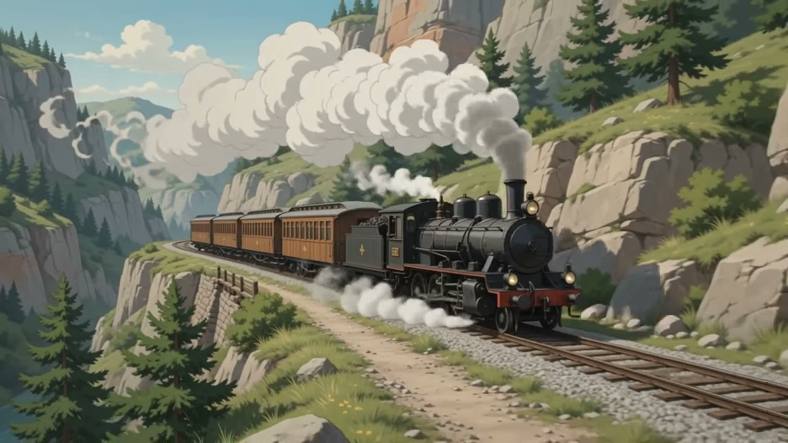
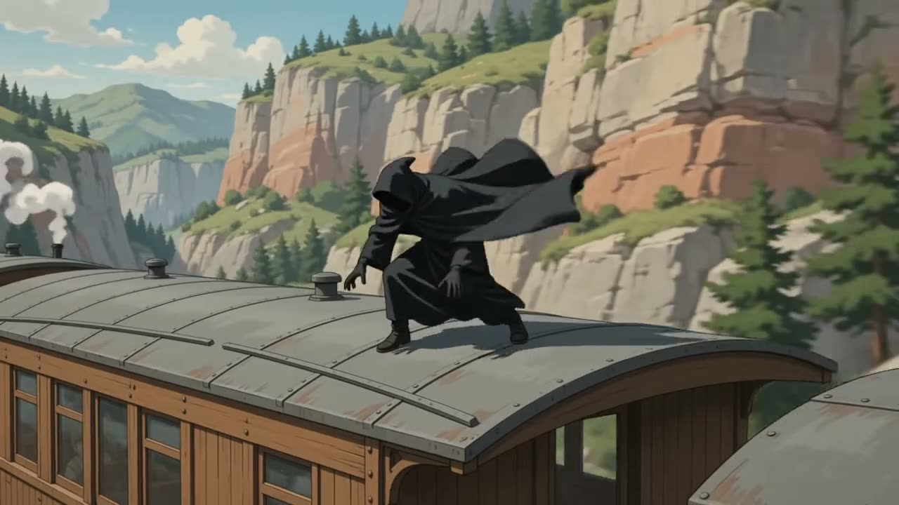
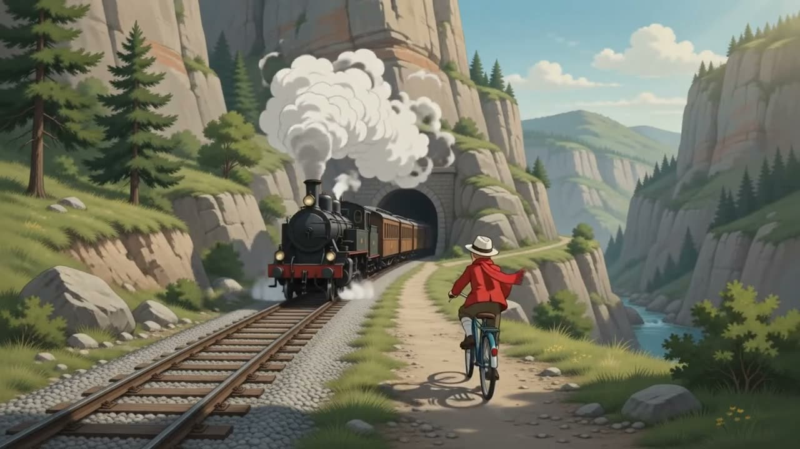
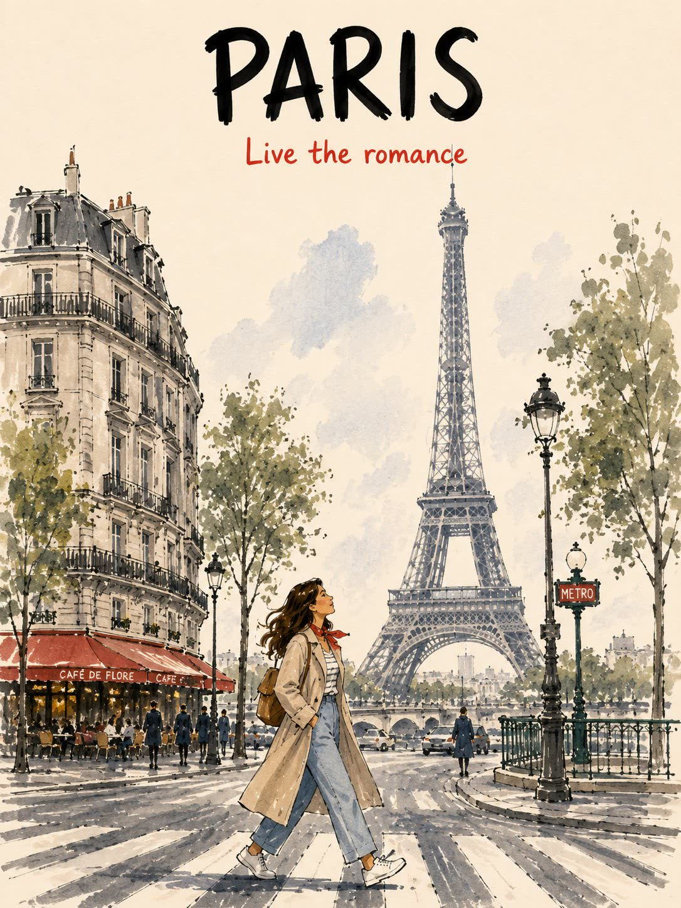
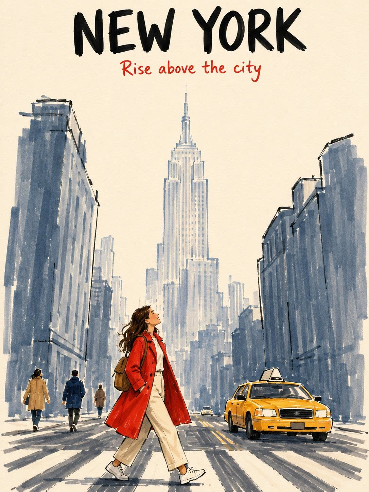

<p align="center">
  
</p>

<h1 align="center">Donkey</h1>

<p align="center"><i>The video editor iMovie should have been — free, open source, and local-first, with AI generation when you want it.</i></p>

<p align="center">
  <a href="https://github.com/DonkeyUseCorp/Donkey/releases/latest"></a>
  <a href="LICENSE"></a>
  
  <a href="https://donkeyuse.com/donkeyvision"></a>
</p>

Donkey is two things in one repository:

- **Donkey Cut** — a free browser video editor at [donkeycut.com](https://donkeycut.com), powered by a local engine that ships inside the companion Mac app.
- **Donkey Vision** — a screen-understanding API that turns any screenshot into structured, clickable UI, so you can build computer-use tools of your own.

---

## Donkey Cut

Open [donkeycut.com](https://donkeycut.com) and you're in a full editor: multi-track timeline, captions, music and effects tracks, and an AI assistant that edits alongside you. The page is only the client — every real operation runs on a local engine the Donkey Mac app ships and supervises, so your footage stays on your Mac. No uploads, no cloud storage fees.

<p align="center">
  
  <br />
  <sub><i>The editor with "The Railway Mystery" open — generated shots in the side panel, clips and score on the timeline, and the AI chat that assembled them.</i></sub>
</p>

### Free and local

Editing needs no account. Projects and media live on your own disk, transcription and subtitles run on-device, and exports render through the bundled ffmpeg. The assistant uses the Claude or Codex app already signed in on your Mac — if you have a subscription, you're done. No setup, no API keys.

The one hosted piece is AI generation: images, video, voiceovers, and music are rendered through your Donkey account and credits, then land back in your project like any other file.

### Generate what you can't shoot

Describe a shot in chat and iterate until it's right. These are the two example projects from the [donkeycut.com](https://donkeycut.com) landing page, prompts included.

**The Railway Mystery** — a 1920s comic-style chase, three generated shots cut together with a brass-and-strings score:

> Franco-Belgian comic style, early-1900s animation with film grain: a steam train races a cliffside railway through a mountain canyon; a cloaked figure rides the carriage roof; a boy on a bicycle gives chase

| Canyon run | On the roof | Bicycle chase |
| --- | --- | --- |
|  |  |  |

**City poster series** — matched hand-painted travel posters, animated into 4-second clips and cut with captions and a waltz:

> Hand-painted travel poster, PARIS — woman in a trench coat crossing the street, Eiffel Tower behind, café awnings, 'Live the romance' in red script

| Paris — Live the romance | New York — Rise above the city |
| --- | --- |
|  |  |

<p align="center">
  
  <br />
  <sub><i>The poster series in the editor — both posters animated into clips, cut with captions and a waltz.</i></sub>
</p>

### How it works

The hosted page and the local engine split the work: the page comes from wherever is convenient, the work always happens on your Mac.

```text
browser (donkeycut.com or localhost)
        │  API calls
        ▼
Cut engine on 127.0.0.1 — shipped and supervised by the Donkey Mac app
        │
        ▼
local disk · bundled ffmpeg · on-device speech · your claude/codex logins
```

On a hosted deploy every Cut API answers 404 before any handler runs — the server side of Cut exists only on your machine. The full architecture lives in [`docs/guides/cut/README.md`](docs/guides/cut/README.md).

### Pricing

The editor is free. Pay only for AI-generated media: the Pro plan ($20/month) adds monthly credits for image, video, voiceover, and music generation.

---

## Donkey Vision

Donkey Vision turns a screenshot into structured UI the way the app does. Send an image, get back every interactable element — buttons, icons, inputs, rows, text — each with a bounding box, a center point, and a label. Because it reads pixels, it works on software that exposes no API at all: native apps, the web, Electron, games, remote desktops, and VNC sessions.

Pass a natural-language `instruction` like `click the play button` and it returns the matching target with a ready-to-click point.

| Apple Music | Desktop |
| --- | --- |
|  |  |

### Example

```bash
curl "https://donkeyuse.com/api/vision" \
  -H "Authorization: Bearer $DONKEY_API_KEY" \
  -H "Content-Type: application/json" \
  -d '{
    "image": "iVBORw0KGgo...",        # base64 png/jpeg/webp, no "data:" prefix
    "instruction": "click the play button",
    "returnElements": true
  }'
```

```jsonc
{
  "image": { "width": 1440, "height": 900 },
  "elements": [
    {
      "label": "Play",
      "kind": "button",
      "interactive": true,
      "box": { "x": 618, "y": 816, "width": 42, "height": 42 },
      "point": { "x": 639, "y": 837 },   // ready to click
      "confidence": 0.82
    }
  ],
  "target": { "label": "Play", "point": { "x": 639, "y": 837 }, "confidence": 0.91 }
}
```

A warm parse takes about **0.7s** server-side. See [donkeyuse.com/donkeyvision](https://donkeyuse.com/donkeyvision) for the full reference and to get a key. The parsing model and its latency notes live in [`docs/guides/donkey-vision.md`](docs/guides/donkey-vision.md) and [`vision/`](vision/).

---

## Repository layout

| Path | What's there |
| --- | --- |
| [`apps/Donkey`](apps/Donkey) | The macOS companion app; it ships and supervises the Cut engine. |
| [`site`](site) | The Next.js site, the Cut editor and engine, and hosted API routes (including Vision). |
| [`vision`](vision) | The screenshot-parsing worker and its benchmarks. |
| [`docs`](docs/README.md) | Supported product behavior and engineering guides. |
| [`plans`](plans) | Active and historical implementation planning. |

## Build and run

Run the editor locally:

```sh
cd site
npm install
npm run db:generate
npm run dev
```

The editor is at `http://localhost:3000/cut`.

Run the macOS app in development:

```sh
cd apps/Donkey
swift run Donkey
```

Build the packaged app and installer disk image:

```sh
./scripts/package-donkey-app.sh
open dist/Donkey.app
```

The site uses Supabase Postgres through Prisma. Keep local credentials in `.env` and never commit them.

## Documentation

[`docs/README.md`](docs/README.md) is the source of truth for supported behavior. Good starting points:

- [Cut](docs/guides/cut/README.md) — the editor, its local engine, and the boundary between them.
- [Donkey Vision](docs/guides/donkey-vision.md) — the screen-understanding layer.
- [Install Donkey Locally](docs/guides/install-donkey.md) — building the app bundle.

## License

Apache 2.0 — see [LICENSE](LICENSE).
