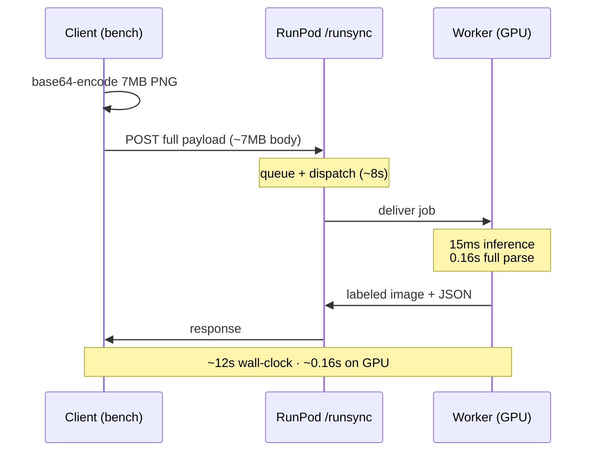

# OmniParser latency notes

Real numbers from our screenshot parser (OmniParser V2) on a RunPod serverless
GPU. Test image: a Spotify screenshot, 104 UI elements.

---

We ran the parser 4 times in a row on the same screenshot. Here's what the
client saw:

```
run 1 (cold):  35.39s
run 2 (warm):  12.09s
run 3 (warm):  12.62s
run 4 (warm):  18.11s
```

~12s warm felt slow, so we checked the worker logs to see where the time went.

The GPU work is tiny:

```
0: 832x1280  85 icons, 15.3ms
Speed: 6.4ms preprocess, 15.3ms inference, 1.1ms postprocess
time to get parsed content: 0.16s
```

15ms of inference. 0.16s for the full parse including captions. So where do the
other ~12 seconds go?

We lined up the client timer against the worker's own start/finish logs:

```
              client     worker        actual
run           measured   start->fin    inference
─────────────────────────────────────────────────
1 (cold)      35.39s     5.6s          74ms
2 (warm)      12.09s     3.8s          15ms
3 (warm)      12.62s     3.6s          15ms
4 (warm)      18.11s     3.7s          15ms
```

The worker is idle for ~8-9s between jobs. It finishes one and sits there with
nothing to do until the next request shows up.

That idle time is everything that happens off the GPU:

```
 client                  network / RunPod                worker (GPU)
   │                                                          │
   ├── base64-encode 7MB PNG ────────────────────►           │
   │     upload full payload in HTTP body                     │
   │                                                          │
   │                  ┌─ runsync queue + dispatch ─┐          │
   │                  └────────────────────────────┴────────► │ start
   │                                                          │  ▓ 15ms inference
   │                                                          │  ▓ 0.16s parse
   │                  ◄──────── response ──────────┬───────── │ finish
   │                                               │          │
   ◄── download labeled image + JSON ──────────────┘          │
   │                                                          │
 ~12s total                                              ~0.16s of it
```

Three things eat the time, in order:

1. We upload a 7MB base64 PNG on every call. The model only needs an 832x1280
   image, so we're shipping a huge file to feed a small input.
2. RunPod's `/runsync` queue and dispatch. The request waits before the worker
   even sees it.
3. Downloading the response (the labeled image comes back too).

Cold start adds ~20s on top: container boot plus downloading the Florence-2
weights.

We also ran the whole thing on CPU only, on an M3 MacBook Pro. No GPU.

Total time: 150-300s per screenshot. That's 10-20x the warm cloud number. So the
GPU does buy real speed here. It's just being buried under the upload and queue
time.

What we're changing:

- Compress the screenshot before upload (downscale to 896px, JPEG). The app
  already does this; the benchmark now does too. A 7MB PNG drops to ~70KB.
- Keep at least one active worker so cold starts don't hit users.
- Measure compute and transport separately. A log that says "15ms" and a client
  that says "12s" are both right; they measure different things.
- CPU-only stays a fallback. 150-300s isn't usable for anything interactive.

Bottom line: the model is fast enough. The slow part is the upload and the
serverless queue, not the GPU. Fix the pipe first.

---

## Methodology & raw data

- Endpoint: `https://api.runpod.ai/v2/<id>/runsync` (RunPod serverless, single GPU)
- Image: `spotify.png`, 6980 KB as base64, 104 detected elements
- Runs: 4 sequential (run 1 cold, rest warm), `vision/bench/bench_endpoint.py`
- Worker: OmniParser V2 — YOLO `icon_detect` + Florence-2 `icon_caption`, CUDA 12.8

| Measure | Cold | Warm (median) |
| --- | --- | --- |
| Client wall-clock | 35.39s | 12.62s |
| Worker job span (start->finish) | 5.6s | ~3.7s |
| YOLO inference | 74ms | 15ms |
| Full parse (`time to get parsed content`) | 0.52s | 0.16s |

Idle gap between worker jobs (pure transport + queue): ~8-9s.

CPU-only floor (M3 MacBook Pro, no GPU): 150-300s total per screenshot.

### Sequence diagram


